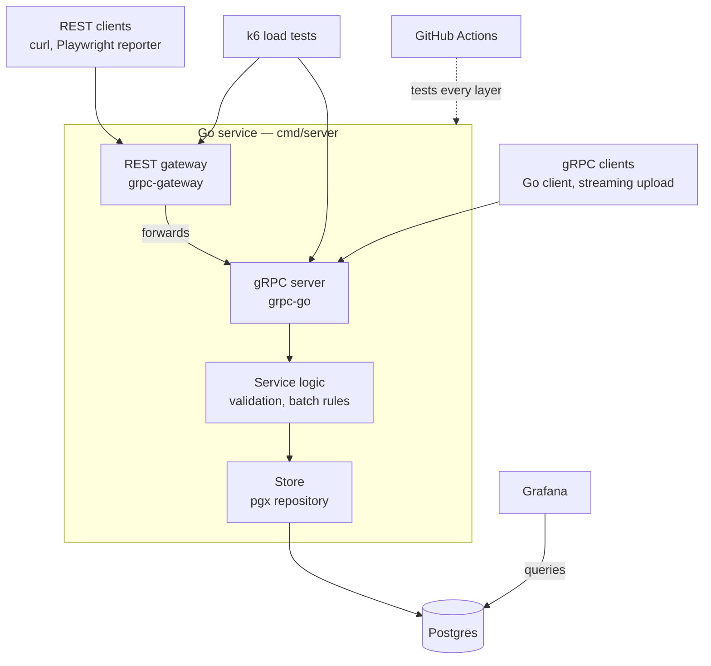

# results-service

[](https://github.com/adamsjoe/results-service/actions/workflows/ci.yml)

A Go backend that ingests automated test results over **gRPC** and **REST**, stores them in **Postgres** and feeds **Grafana** dashboards — built and tested to production standard.

The service is the vehicle; the testing is the point. Every layer is covered: unit tests written test-first, integration tests against real Postgres, API tests over both protocols, k6 load tests and deliberate reliability tests, all running in CI.

> **Status:** Milestone 7 of 10 complete — reliability proven against real Postgres: database outages return Unavailable/503 and recover without a restart, abandoned writes leave nothing behind, SIGTERM drains in-flight requests, and fuzzing finds no input that causes a 5xx. See [Roadmap](#roadmap).

---

## Quick start

**Prerequisites:** Docker Engine with Compose v2, and `make`. No local Go toolchain is needed to run the stack.

To develop: Go (version per `go.mod`) and [buf](https://buf.build/docs/installation) (`go install github.com/bufbuild/buf/cmd/buf@v1.73.0`). Generated code in `gen/` is committed, so buf is only needed when the proto changes.

```bash
git clone https://github.com/adamsjoe/results-service.git
cd results-service
make up
curl localhost:8080/healthz   # → ok
```

Try the gRPC API with [grpcurl](https://github.com/fullstorydev/grpcurl) (`go install github.com/fullstorydev/grpcurl/cmd/grpcurl@latest`):

```bash
grpcurl -plaintext localhost:9090 list

grpcurl -plaintext -d '{"suite":"checkout-e2e","branch":"main","commit_sha":"abc123"}' \
  localhost:9090 results.v1.ResultsService/CreateRun

grpcurl -plaintext -d '{"run_id":"<id>","results":[
  {"name":"login works","status":"STATUS_PASSED","duration_ms":120},
  {"name":"checkout total","status":"STATUS_FAILED","duration_ms":340,"error_message":"expected 9.99"}
]}' localhost:9090 results.v1.ResultsService/RecordResults

grpcurl -plaintext -d '{"run_id":"<id>"}' localhost:9090 results.v1.ResultsService/GetRun
```

Proto3 JSON omits zero values, so counts appear only once results exist.

Or the same API over REST — responses use snake_case keys and always include zero counts:

```bash
curl -s -X POST localhost:8080/v1/runs -d '{"suite":"checkout-e2e","branch":"main","commit_sha":"abc123"}'
curl -s -X POST localhost:8080/v1/runs/<id>/results -d '{"results":[{"name":"login works","status":"STATUS_PASSED","duration_ms":120}]}'
curl -s localhost:8080/v1/runs/<id>
curl -s "localhost:8080/v1/runs?suite=checkout-e2e&page_size=5"
```

| Endpoint | Address | Status |
| --- | --- | --- |
| REST | `localhost:8080` | Live under `/v1/`, plus `/healthz` |
| gRPC | `localhost:9090` | Live, with server reflection |
| Grafana | `localhost:3000` | Running, dashboards planned (milestone 9) |
| Postgres | `localhost:5432` | Running |

### Make targets

| Target | Does |
| --- | --- |
| `make up` | Build and start the stack |
| `make down` | Stop the stack, keep data |
| `make reset` | Stop the stack and wipe the database |
| `make logs` | Follow server logs |
| `make psql` | SQL shell on the app database |
| `make test` | Run all Go test layers in a container |
| `make load` | Run a k6 script against the stack (`SCRIPT=baseline` by default; also `ramp`, `batch`, `soak`) |
| `make seed` | Load 20,000 runs and 1,000,000 results, to load-test against a large table |
| `make proto-deps` | Resolve proto dependencies and update `buf.lock` |
| `make proto-lint` | Lint and format-check the proto files |
| `make proto` | Regenerate Go code into `gen/` |

---

## Architecture



REST calls pass through the gateway into the same gRPC handlers, so both protocols share one code path down to Postgres. Grafana reads the tables directly.

The server binary has three subcommands so one image does every job:

| Subcommand | Does |
| --- | --- |
| `serve` | Runs the gRPC server and the REST gateway with `/healthz` (default); shuts down gracefully on SIGTERM, HTTP first |
| `migrate` | Applies pending SQL migrations embedded in the binary |
| `healthcheck` | Calls `/healthz`, exits non-zero on failure — used by Docker, as the distroless image has no shell or curl |

---

## API

One protobuf file ([`proto/results/v1/results.proto`](proto/results/v1/results.proto)) defines the API; buf generates the Go message types, gRPC stubs and REST gateway into `gen/`. Handlers are implemented from milestone 5.

| RPC | REST | Notes |
| --- | --- | --- |
| `CreateRun` | `POST /v1/runs` | Start a test run (suite, branch, commit) |
| `RecordResults` | `POST /v1/runs/{run_id}/results` | Batch of up to 1,000 results |
| `StreamResults` | — | gRPC only: client-streaming upload |
| `GetRun` | `GET /v1/runs/{run_id}` | Run with pass/fail/skip counts |
| `ListRuns` | `GET /v1/runs` | Paginated, filterable by suite |

---

## Service rules

Implemented in [`internal/service`](internal/service), which has no gRPC, HTTP or SQL in it. Transports call it; stores implement its `Store` interface.

| Operation | Rule |
| --- | --- |
| Create run | Suite, branch and commit SHA are required |
| Record results | Batch must hold 1–1,000 results; an unknown run is not found |
| Record results | A result with an empty name, unknown status or negative duration is rejected on its own; valid results in the same batch are still stored |
| Get run | Returns pass, fail and skip counts computed from stored results |
| List runs | Newest first, optional suite filter; page size 0 means 20, above 100 is capped at 100; page tokens are opaque |

Errors are `ErrInvalidArgument` or `ErrNotFound`, mapped to gRPC and HTTP status codes in the transport layer.

---

## Test strategy

| Layer | Runs against | Covers |
| --- | --- | --- |
| Unit (TDD) ✅ | In-memory store ([`internal/memstore`](internal/memstore)) | Validation, partial-batch acceptance, pagination rules — 93% coverage |
| Contract ✅ | Both stores ([`internal/storetest`](internal/storetest)) | 14 behaviours every `Store` must meet, so the in-memory test double matches Postgres |
| Integration ✅ | Real Postgres: testcontainers-go in CI, `postgres-test` under `make test` | Contract suite plus migrations, atomic batches, constraints, cascades |
| gRPC API ✅ | Real gRPC server over bufconn ([`test/api`](test/api)) | Every RPC, status codes, streaming (incl. cancellation stores nothing), deadlines, no internal details leaked |
| REST API ✅ | Real gateway over HTTP ([`test/api`](test/api)) | Same behaviours as gRPC from one shared case table, plus JSON shape, bad bodies, error format, routing |
| Contract | Proto file | `buf lint` and `buf breaking` against main |
| Load | Docker Compose stack | k6 throughput and latency, both protocols |
| Reliability ✅ | Real Postgres, in-process servers and the real binary ([`test/reliability`](test/reliability)) | Database outage → Unavailable/503 then recovery without restart; deadline mid-write leaves nothing stored; SIGTERM refuses new HTTP but finishes the in-flight write and exits 0 |
| Fuzz ✅ | Service and REST gateway | Random page tokens and request bodies: never a panic, never a 5xx. Seeds run on every `go test` |

---

## Load testing

k6 scripts in [`test/load`](test/load) run the same workload over both protocols. One iteration is one simulated CI pipeline: create a run, post a batch of 50 results, read the run back, list recent runs.

| Script | Shape | Shows |
| --- | --- | --- |
| `baseline` | 10 pipelines/s for 2 minutes per protocol, one after the other | Normal latency per endpoint; runs for 30 s per protocol in CI |
| `ramp` | Rate rising to 400 pipelines/s on one protocol (`-e PROTOCOL=grpc`), stopping once over 5% of checks fail | Where throughput tops out |
| `batch` | Batches of 10, 100 and 1,000 results per protocol | What payload size costs, gRPC versus JSON |
| `soak` | Both protocols at once for 30 minutes | Slow leaks that short runs miss |

```bash
make up
make seed                                    # optional: test against a large table
make load                                    # baseline
make load SCRIPT=ramp K6_ARGS="-e PROTOCOL=rest"
```

### Baseline

`make load`, 10 pipelines/s per protocol for 2 minutes each, 50 results per batch; all checks passed, 0 failed requests. Measured with the full stack in Docker on a developer workstation, so treat the numbers as relative rather than absolute.

| Endpoint | REST p95 | gRPC p95 | Threshold |
| --- | --- | --- | --- |
| CreateRun | 3.6 ms | 2.9 ms | < 20 ms |
| RecordResults (50 results) | 6.5 ms | 6.0 ms | < 30 ms |
| GetRun | 1.7 ms | 1.4 ms | < 10 ms |
| ListRuns (20 runs) | 8.1 ms | 14.1 ms | < 50 ms |

gRPC is slightly faster on every write and read except `ListRuns`, the largest response. k6 decodes gRPC responses dynamically through reflection, which is client-side work REST responses don't pay in these scripts, so that gap is not yet evidence of a server-side difference. Thresholds sit at about 5x these figures so that slower shared CI runners still pass while a real regression fails the build.

---

## Tech stack

Go · grpc-go · grpc-gateway v2 · buf · pgx v5 · testcontainers-go · k6 (v2) · golangci-lint · Docker Compose · Grafana · GitHub Actions

---

## Roadmap

| # | Milestone | Status |
| --- | --- | --- |
| 1 | Skeleton — stub server, Docker stack, CI | ✅ Done |
| 2 | Proto and codegen with buf | ✅ Done |
| 3 | Service logic, test-first | ✅ Done |
| 4 | Postgres store and migrations | ✅ Done |
| 5 | gRPC server | ✅ Done |
| 6 | REST gateway | ✅ Done |
| 7 | Reliability tests | ✅ Done |
| 8 | Load tests (k6) | ⬜ Next |
| 9 | Grafana dashboard | ⬜ |
| 10 | README: results and write-up | ⬜ |

---

## Issues and fixes log

Problems hit during the build and how they were resolved. Newest first.

| Milestone | Issue | Cause | Fix |
| --- | --- | --- | --- |
| 8 | `ListRuns` took ~550 ms with 20,000 runs and 1,000,000 results, and grew with the table (filtering by suite: ~225 ms) | The query joined every run to its results and counted them all, then sorted and kept one page — so each call did work proportional to the whole table | Select the page of runs first using the `started_at` index, then count results for those runs only: ~2 ms for both. Reproduce with `make seed` |
| 7 | Graceful-shutdown test failed under `make test` only: `go build: error obtaining VCS status: exit status 128` | The test builds the server binary; Go stamps Git details into builds, but in the test container the bind-mounted repo is owned by another user, so Git refuses to read it | Test builds with `-buildvcs=false` |
| 7 | A database outage reached clients as `Internal` / HTTP 500 | The store passed connection failures up unclassified, so they fell through to the catch-all mapping — telling clients "server bug" rather than "try again" | Store marks connection failures as `ErrUnavailable` → gRPC `Unavailable` / HTTP 503; covered by `TestDatabaseOutage_ReturnsUnavailableThenRecovers` |
| 7 | Design change: database loss is simulated rather than done by stopping the container | Restarting a testcontainers container gives it a new host port, so the running service could never reconnect; and integration packages sharing one test database would break each other | `internal/testpg` gives each test package its own database; an outage is simulated by dropping every connection and refusing new ones, then allowing them again |
| 6 | REST test found a known path with the wrong method (e.g. `DELETE /v1/runs`) returned 501 Not Implemented | grpc-gateway's default routing handler maps "method not allowed" to gRPC Unimplemented, which becomes HTTP 501 | Custom routing error handler in `internal/transport/gateway.go` returns 405; covered by `TestREST_RoutesAndMethods` |
| 4 | Design change: goose dropped as the migration tool | goose pulls drivers for around ten databases (ClickHouse, MySQL, SQL Server, SQLite and more) into the module graph, for a project that only uses Postgres | Small embedded runner in `internal/store/migrate.go`: applies `migrations/*.sql` in order, records each in `schema_migrations`, holds an advisory lock |
| 2 | Original API design would not pass buf `STANDARD` lint | `CreateRun`/`GetRun` shared a `Run` response, `StreamResults` streamed bare `TestResult`s, and enum values lacked the `STATUS_` prefix | Every RPC has its own `<Rpc>Request`/`<Rpc>Response`; enum values renamed `STATUS_PASSED` etc. |
| 1 | golangci-lint found two `errcheck` issues in the first stub (caught before the first push) | golangci-lint v2 flags unchecked errors from `fmt.Fprintln` and `resp.Body.Close` | Errors explicitly discarded (`_, _ =` and a deferred closure) |
| 1 | `make up` failed: `"/go.sum": not found` | `go.sum` only exists once a module has external dependencies; the stub is standard library only | Dockerfile copies `go.sum*`, making it optional |
