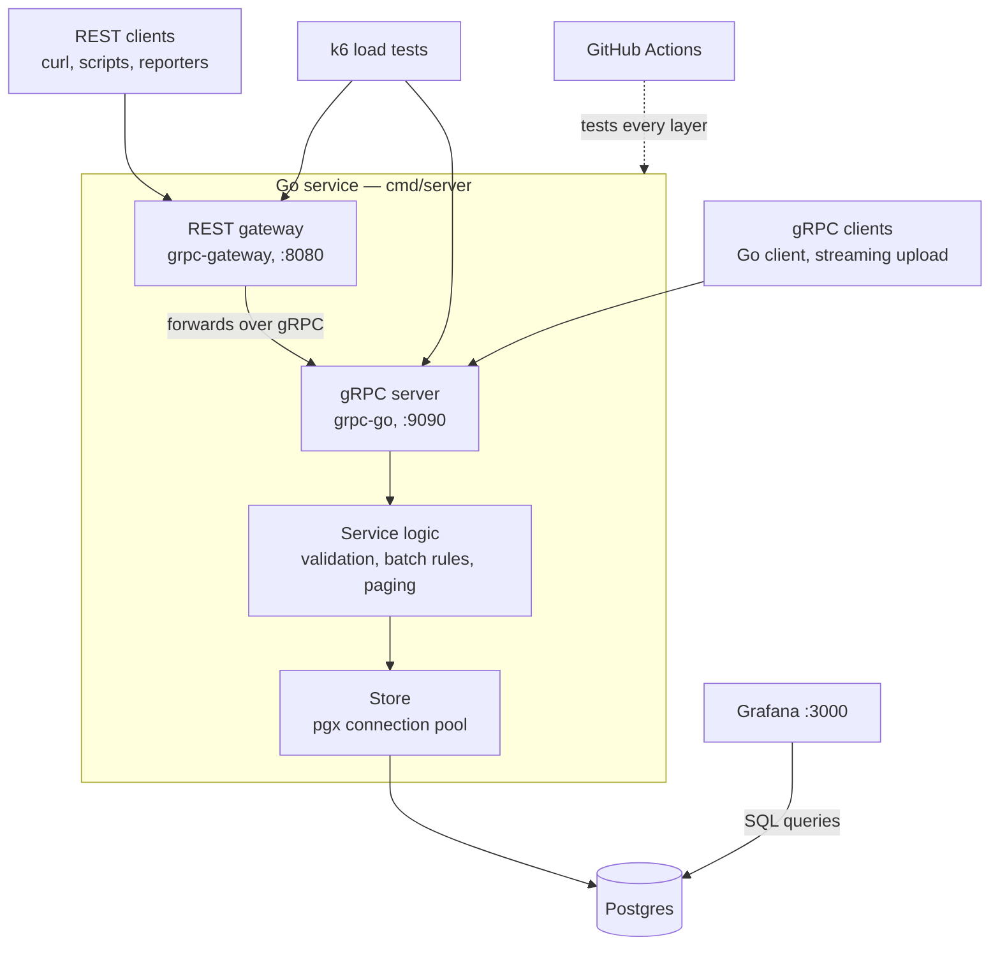
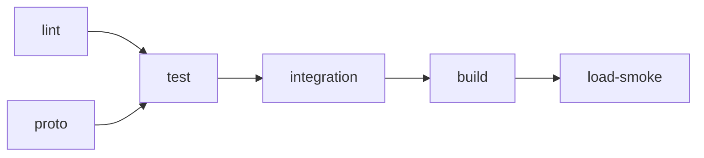
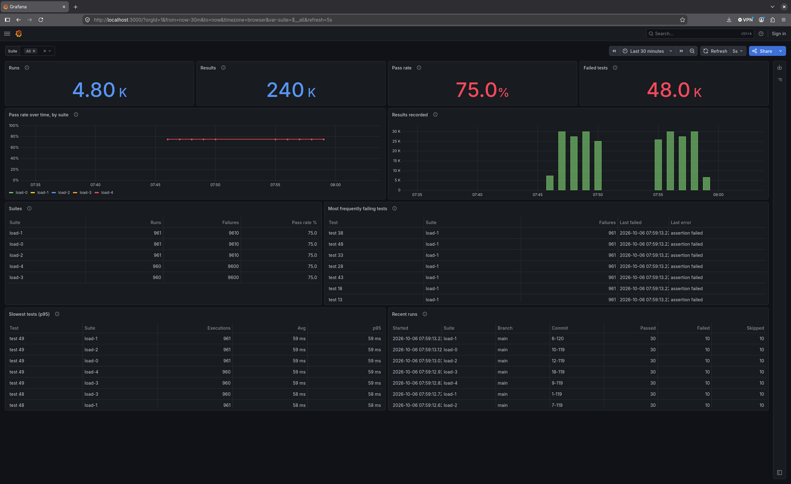

# results-service

[](https://github.com/adamsjoe/results-service/actions/workflows/ci.yml)

A Go service that ingests automated test results over **gRPC** and **REST**, stores them in **Postgres** and feeds a **Grafana** dashboard.

The service is the vehicle; the testing is the point. It is built and tested the way production backends should be: test-first business rules, a contract suite that holds the test double to the real database, API tests that run every behaviour over both protocols, reliability tests that pull the database out from under a running server, fuzzing, and k6 load tests — all running in CI on every push.

---

## What this demonstrates

| Area | Evidence |
| --- | --- |
| Go backend development | gRPC and REST from one protobuf definition, Postgres via pgx, graceful shutdown, structured logging, a distroless container image |
| Test strategy and design | 157 test cases across every layer from unit to load, each layer testing what the one below cannot ([Test strategy](#test-strategy)) |
| Test-first development | Service rules committed as failing tests before the implementation; 98% coverage of the service and transport layers |
| Test doubles you can trust | One contract suite runs against both the in-memory store and Postgres, so unit tests can't drift from reality |
| Reliability and failure testing | Database outage, mid-write deadline and SIGTERM-under-load tests against real Postgres and the real binary |
| Performance testing | k6 scenarios over both protocols; baseline thresholds enforced in CI |
| CI/CD | Six GitHub Actions jobs on every push: lint, proto contract checks, unit tests, integration and reliability tests, build (binary and Docker image), and a k6 smoke load against the full Docker stack |
| Observability | Grafana dashboard provisioned as code, reading straight from Postgres |

### Defects the tests found

Each was found by testing done for this project and then fixed; the outage and gateway fixes have regression tests, and the listing fix can be reproduced with `make seed`. Full details in the [issues log](#issues-and-fixes-log).

- **Slow listing at scale.** Seeding a million results showed `ListRuns` taking ~550 ms and growing with the table. The query counted every run's results before keeping one page. After the fix: ~2 ms.
- **Outages reported as server bugs.** A database outage reached clients as `Internal` / HTTP 500. Connection failures are now `Unavailable` / 503, telling clients to retry, and the service recovers without a restart.
- **Wrong HTTP status from the gateway.** A known path with the wrong method returned 501 Not Implemented, grpc-gateway's default. It now returns 405.

---

## Contents

- [Quick start](#quick-start)
- [Project layout](#project-layout)
- [Architecture](#architecture)
- [API reference](#api-reference)
- [Service rules](#service-rules)
- [Errors and status codes](#errors-and-status-codes)
- [Data model and migrations](#data-model-and-migrations)
- [Configuration](#configuration)
- [Test strategy](#test-strategy)
- [Test layers in detail](#test-layers-in-detail)
- [Continuous integration](#continuous-integration)
- [Load testing](#load-testing)
- [Dashboard](#dashboard)
- [Design decisions](#design-decisions)
- [Development workflow](#development-workflow)
- [Troubleshooting](#troubleshooting)
- [Limitations and next steps](#limitations-and-next-steps)
- [Tech stack](#tech-stack)
- [Issues and fixes log](#issues-and-fixes-log)

---

## Quick start

### Prerequisites

| To | You need |
| --- | --- |
| Run the stack, tests and load tests | Docker Engine with Compose v2, and `make` |
| Develop (edit Go code, run `go test` directly) | Go, at the version in `go.mod` |
| Change the API definition | [buf](https://buf.build/docs/installation): `go install github.com/bufbuild/buf/cmd/buf@v1.73.0` |
| Call the gRPC API by hand | [grpcurl](https://github.com/fullstorydev/grpcurl): `go install github.com/fullstorydev/grpcurl/cmd/grpcurl@latest` |

Generated code in `gen/` is committed, so buf is only needed when `results.proto` changes. Tools installed with `go install` land in `~/go/bin`, which must be on your `PATH`.

### Run it

```bash
git clone https://github.com/adamsjoe/results-service.git
cd results-service
make up                        # builds the image, starts Postgres, migrates, starts the server and Grafana
curl localhost:8080/healthz    # → ok
```

`make up` starts the services in dependency order: Postgres must pass its health check, then the one-shot `migrate` container applies the schema and exits, and only then does the server start. Grafana starts once Postgres is healthy.

| Service | Address | What's there |
| --- | --- | --- |
| REST | `localhost:8080` | The API under `/v1/`, plus `/healthz` |
| gRPC | `localhost:9090` | The API, with server reflection enabled |
| Grafana | `localhost:3000` | The **Test results** dashboard as the home page, no login needed |
| Postgres | `localhost:5432` | Database `results`, user `results`, password `results` (local only) |

### Try the REST API

```bash
# Create a run
curl -s -X POST localhost:8080/v1/runs \
  -d '{"suite":"checkout-e2e","branch":"main","commit_sha":"abc123"}'

# Record results against it (use the id from the response above)
curl -s -X POST localhost:8080/v1/runs/<id>/results -d '{"results":[
  {"name":"login works","status":"STATUS_PASSED","duration_ms":120},
  {"name":"checkout total","status":"STATUS_FAILED","duration_ms":340,"error_message":"expected 9.99"},
  {"name":"","status":"STATUS_PASSED","duration_ms":5}
]}'
# → {"accepted":2,"rejected":1}   the result with no name breaks a rule

# Read the run back, with its counts
curl -s localhost:8080/v1/runs/<id>

# List recent runs for a suite
curl -s "localhost:8080/v1/runs?suite=checkout-e2e&page_size=5"
```

### Try the gRPC API

```bash
grpcurl -plaintext localhost:9090 list

grpcurl -plaintext -d '{"suite":"checkout-e2e","branch":"main","commit_sha":"abc123"}' \
  localhost:9090 results.v1.ResultsService/CreateRun

grpcurl -plaintext -d '{"run_id":"<id>","results":[
  {"name":"login works","status":"STATUS_PASSED","duration_ms":120}
]}' localhost:9090 results.v1.ResultsService/RecordResults

grpcurl -plaintext -d '{"run_id":"<id>"}' localhost:9090 results.v1.ResultsService/GetRun
```

grpcurl prints proto3 JSON, which leaves out fields that are zero, so a new run shows no counts until results exist. The REST API always includes them.

### Tidying up

The stack keeps running in the background until you stop it.

```bash
make down      # stop everything; data is kept, and make up brings it all back
make reset     # stop everything and wipe the app database
```

Both include the `postgres-test` container that `make test` starts and leaves running. Plain `docker compose down` misses it, because it belongs to the `test` profile.

To reclaim disk space as well:

```bash
docker image rm results-server results-migrate    # this project's built images
docker system prune                                # all stopped containers, unused networks, dangling images and build cache
```

`docker system prune` is not limited to this project: it clears unused Docker resources from every project on the machine, so check its prompt before confirming. Named volumes, including the database, are only removed with `--volumes`.

### Make targets

| Target | Does |
| --- | --- |
| `make up` | Build the image and start the stack in the background |
| `make down` | Stop and remove every container in the project, including the test database and k6, keeping the data |
| `make reset` | As `make down`, and also delete the app database volume |
| `make logs` | Follow the server's logs |
| `make psql` | Open a SQL shell on the app database |
| `make seed` | Load 20,000 runs and 1,000,000 results into the app database (about 10 seconds; run it once) |
| `make test` | Run every Go test layer in a container, against a throwaway test database |
| `make load` | Run a k6 script against the running stack. `SCRIPT=baseline` by default; also `ramp`, `batch`, `soak`. Pass extra k6 arguments with `K6_ARGS` |
| `make proto-deps` | Resolve proto dependencies (googleapis) and update `buf.lock` |
| `make proto-lint` | Lint and format-check the proto files |
| `make proto` | Regenerate Go code into `gen/` |

---

## Project layout

```text
.
├── cmd/server/main.go           the binary: serve, migrate and healthcheck subcommands
├── proto/results/v1/            results.proto, the single source of the API
├── gen/results/v1/              Go code generated by buf (committed)
├── internal/
│   ├── service/                 business rules and validation; no gRPC, HTTP or SQL
│   ├── store/                   Postgres implementation of service.Store, and the migration runner
│   ├── memstore/                in-memory implementation of service.Store, used as the test double
│   ├── storetest/               contract suite every Store implementation must pass
│   ├── transport/               gRPC handlers, error mapping, request logging, and the REST gateway
│   └── testpg/                  test helper: a fresh Postgres database per test package, outage simulation
├── migrations/                  SQL migrations, embedded into the binary
├── test/
│   ├── api/                     end-to-end API tests over gRPC and REST, and REST fuzzing
│   ├── reliability/             outage, deadline and shutdown tests against real Postgres
│   └── load/                    k6 scripts and the seed dataset
├── deploy/grafana/              data source, dashboard provider and dashboard JSON
├── docs/                        README images
├── buf.yaml, buf.gen.yaml       proto lint rules and code generation config
├── Dockerfile                   multi-stage build to a distroless image
├── docker-compose.yml           local stack, plus test and load profiles
├── Makefile                     the commands above
└── .github/workflows/ci.yml     the CI pipeline
```

Dependencies point inwards: `transport` and `store` depend on `service`; `service` depends on nothing in the project. That is what lets the business rules be tested with no network or database at all.

---

## Architecture



**One code path for both protocols.** The REST gateway does not call the service directly. It turns each HTTP request into a gRPC call and sends it to the same process's own gRPC server. Validation, error mapping and logging therefore happen once, in one place, and the two protocols cannot drift apart. The cost is one extra in-process hop per REST call.

**Layers.**

| Layer | Package | Responsibility |
| --- | --- | --- |
| Transport | `internal/transport` | Decode protobuf, translate to domain types, call the service, map errors to status codes, log the call |
| Service | `internal/service` | Enforce the rules: required fields, batch limits, per-result validation, page sizes and tokens |
| Store | `internal/store` | Run SQL, keep batches atomic, classify database failures |
| Database | Postgres | Constraints as a last line of defence: valid statuses, non-negative durations, cascading deletes |

**One binary, three jobs.** The same image runs every role, chosen by subcommand:

| Subcommand | Does |
| --- | --- |
| `serve` | Connects to Postgres, starts the gRPC server and the HTTP server (REST gateway plus `/healthz`). Default |
| `migrate` | Applies any pending SQL migrations embedded in the binary, then exits |
| `healthcheck` | Calls `/healthz` and exits 0 or 1. Docker uses it because the distroless image has no shell or curl |

**Graceful shutdown.** On SIGTERM or SIGINT the server:

1. stops the HTTP server first, so no new REST requests arrive (REST requests already in flight still need the gRPC server, so it must outlive them);
2. calls gRPC `GracefulStop`, which refuses new calls and waits for in-flight ones to finish;
3. forces a stop if anything is still running after 10 seconds;
4. closes the database pool and exits 0.

`TestGracefulShutdown_FinishesInFlightRequest` proves this against the real binary.

**Logging.** Structured JSON via `log/slog`. Successful gRPC calls log at debug level so load tests do not flood the logs; failed calls log at info with method, status code and duration; storage outages log at warn; unexpected errors log in full at error level while the client receives only `internal error`.

---

## API reference

One protobuf file, [`proto/results/v1/results.proto`](proto/results/v1/results.proto), defines the whole API. buf generates the Go message types, the gRPC client and server stubs, and the REST gateway from it. REST routes come from `google.api.http` annotations in the same file.

| RPC | REST | Purpose |
| --- | --- | --- |
| `CreateRun` | `POST /v1/runs` | Start a test run for a suite, branch and commit |
| `RecordResults` | `POST /v1/runs/{run_id}/results` | Add a batch of 1–1,000 results to a run |
| `StreamResults` | — | gRPC only: upload results one message at a time |
| `GetRun` | `GET /v1/runs/{run_id}` | A run with its passed, failed and skipped counts |
| `ListRuns` | `GET /v1/runs?suite=&page_size=&page_token=` | Runs newest first, paginated, optionally filtered by suite |

### Messages

| Message | Fields |
| --- | --- |
| `Run` | `id` (UUID), `suite`, `branch`, `commit_sha`, `started_at` (timestamp), `passed`, `failed`, `skipped` |
| `TestResult` | `name`, `status`, `duration_ms`, `error_message` (empty unless failed) |
| `Status` | `STATUS_UNSPECIFIED` (never accepted), `STATUS_PASSED`, `STATUS_FAILED`, `STATUS_SKIPPED` |

Every RPC has its own `<Rpc>Request` and `<Rpc>Response` message, as buf's `STANDARD` lint rules require. That keeps each call free to evolve without affecting the others.

### REST specifics

- **Request bodies** accept either proto field names (`commit_sha`) or JSON names (`commitSha`). Enums are sent as their names, such as `"STATUS_PASSED"`.
- **Responses** use the proto field names (snake_case) and always include zero values, so `"failed": 0` is present rather than missing.
- **Unknown fields, malformed JSON, wrong types and unknown enum names** are rejected with 400 before reaching the service.
- **Error bodies** have the shape `{"code": <gRPC code>, "message": "...", "details": []}`.

### Streaming upload

`StreamResults` lets a client send results as tests finish rather than in one batch. The server collects the whole stream, then stores it as a single batch when the client closes it. So:

- a stream that is cancelled, or whose connection drops, stores nothing;
- every message must carry the same `run_id`, or the stream is rejected with `InvalidArgument` and nothing is stored;
- the 1,000-result limit applies to a stream as a whole;
- an empty stream is rejected, as an empty batch would be.

---

## Service rules

Implemented in [`internal/service`](internal/service), which has no gRPC, HTTP or SQL in it. Transports call it; stores implement its `Store` interface.

| Operation | Rule |
| --- | --- |
| Create run | `suite`, `branch` and `commit_sha` are all required; whitespace-only counts as missing |
| Record results | `run_id` is required; the batch must hold 1–1,000 results; an unknown run is `NotFound`, even if every result in the batch is invalid |
| Record results | Each result is checked on its own: an empty name, an unspecified or unknown status, or a negative duration rejects that result only. Valid results in the same batch are still stored, and the response reports `accepted` and `rejected` |
| Get run | `run_id` is required; counts are computed from stored results at read time, so there is no counter to drift |
| List runs | Newest first, by `started_at` then `id`. Optional suite filter. A page size of 0 means 20; above 100 is capped at 100; negative is rejected. `next_page_token` is empty on the last page |

**Page tokens** are opaque to clients. Internally a token is a base64url-encoded offset. Malformed, non-numeric or negative tokens are rejected with `InvalidArgument`, a behaviour the fuzz test hammers with random input.

---

## Errors and status codes

The service returns one of three sentinel errors; the transport maps them, and anything else, to status codes. REST status codes come from grpc-gateway's standard gRPC-to-HTTP mapping.

| Condition | Service error | gRPC | HTTP | Message to client |
| --- | --- | --- | --- | --- |
| Bad input | `ErrInvalidArgument` | `InvalidArgument` | 400 | The specific rule, e.g. `invalid argument: suite is required` |
| Unknown run | `ErrNotFound` | `NotFound` | 404 | `run "<id>": not found` |
| Database unreachable or dropped the connection | `ErrUnavailable` | `Unavailable` | 503 | `service unavailable, try again later` |
| Client cancelled | — | `Canceled` | 499 | `request cancelled` |
| Client deadline passed | — | `DeadlineExceeded` | 504 | `deadline exceeded` |
| Anything unexpected | — | `Internal` | 500 | `internal error`, never the underlying detail |
| REST path exists, wrong method | — | — | 405 | `Method Not Allowed` |
| REST path does not exist | — | — | 404 | `Not Found` |

**How the store decides "unavailable".** A database error counts as unavailable when it is a failure to connect, a SQLSTATE in the connection-exception class (`08xxx`), a server shutting down, crashing or starting up (`57P01`, `57P02`, `57P03`), a failure before the query was sent, a network error, or an unexpected end of connection. Context cancellation and deadlines are excluded: those are the caller giving up, not the database failing.

**Two other mappings in the store.** A run ID that is not a valid UUID makes Postgres raise `22P02`; the store treats that as `NotFound`, since such an ID cannot match a run. A foreign-key violation while inserting results (the run was deleted mid-request) is also `NotFound`.

---

## Data model and migrations

```sql
CREATE TABLE runs (
  id          UUID PRIMARY KEY DEFAULT gen_random_uuid(),
  suite       TEXT NOT NULL,
  branch      TEXT NOT NULL,
  commit_sha  TEXT NOT NULL,
  started_at  TIMESTAMPTZ NOT NULL DEFAULT now()
);
CREATE INDEX runs_suite_started ON runs (suite, started_at DESC);
CREATE INDEX runs_started ON runs (started_at DESC, id DESC);

CREATE TABLE results (
  id            BIGSERIAL PRIMARY KEY,
  run_id        UUID NOT NULL REFERENCES runs(id) ON DELETE CASCADE,
  name          TEXT NOT NULL,
  status        TEXT NOT NULL CHECK (status IN ('PASSED', 'FAILED', 'SKIPPED')),
  duration_ms   BIGINT NOT NULL CHECK (duration_ms >= 0),
  error_message TEXT,
  recorded_at   TIMESTAMPTZ NOT NULL DEFAULT now()
);
CREATE INDEX results_run ON results (run_id);
```

- Postgres generates run IDs and start times, so the API never trusts client clocks.
- `error_message` is stored as `NULL` rather than an empty string when there is no message.
- The two `runs` indexes serve listing: newest first overall, and newest first within a suite.
- Results are written with Postgres `COPY` inside a transaction that first checks the run exists, so a batch is stored completely or not at all. `TestAddResults_BatchIsAllOrNothing` proves a constraint failure on one row stores none of them.

### Migration runner

Migrations are plain SQL files in [`migrations/`](migrations), named `NNNN_description.sql` and embedded in the binary. `server migrate` (and the test suites) apply them with a small runner in [`internal/store/migrate.go`](internal/store/migrate.go):

1. take a Postgres advisory lock, so two processes migrating at once cannot both apply a file;
2. create `schema_migrations` if it does not exist;
3. apply each file not yet recorded, in name order, each in its own transaction along with the row recording it;
4. release the lock and report which versions were applied.

Running it against an up-to-date database applies nothing, which `TestMigrate_SecondRunAppliesNothing` checks. Migrations only go forward; there are no down migrations.

---

## Configuration

### Server

| Variable | Default | Used by | Meaning |
| --- | --- | --- | --- |
| `DATABASE_URL` | none (required) | `serve`, `migrate` | Postgres connection URL |
| `GRPC_ADDR` | `:9090` | `serve` | gRPC listen address |
| `HTTP_ADDR` | `:8080` | `serve`, `healthcheck` | HTTP listen address for the REST gateway and `/healthz` |

### Tests

| Variable | Meaning |
| --- | --- |
| `TEST_DATABASE_URL` | Postgres server for integration and reliability tests. Each test package creates and drops its own database on it, so the user must be able to create databases. When unset, tests start a Postgres container with testcontainers-go instead |

### Load tests

| Variable | Default | Scripts | Meaning |
| --- | --- | --- | --- |
| `GRPC_TARGET` | `localhost:9090` | all | gRPC address (Compose sets `server:9090`) |
| `HTTP_TARGET` | `http://localhost:8080` | all | REST base URL (Compose sets `http://server:8080`) |
| `DURATION` | `2m` (baseline), `30m` (soak) | baseline, soak | Length of each scenario |
| `RATE` | `10` | baseline | Pipelines per second |
| `BATCH` | `50` | baseline, ramp | Results per pipeline |
| `PROTOCOL` | `rest` | ramp | `rest` or `grpc` |
| `PEAK` | `400` | ramp | Pipelines per second at the top of the ramp |
| `STEP` | `30` | batch | Seconds per batch-size scenario |

Pass them through `make load`, for example `make load SCRIPT=ramp K6_ARGS="-e PROTOCOL=grpc -e PEAK=200"`.

---

## Test strategy

157 test cases (52 test functions and their table-driven cases), all passing with the race detector. Coverage measured across all layers together: 98% of `internal/service`, 98% of `internal/transport`, 84% of `internal/store`.

The layers are arranged so each one tests what the layer below cannot, and the cheap fast layers carry most of the weight.

| Layer | Runs against | Covers | Needs Docker |
| --- | --- | --- | --- |
| Unit, test-first | In-memory store ([`internal/memstore`](internal/memstore)) | Validation, partial-batch acceptance, pagination rules | No |
| Contract | Both stores ([`internal/storetest`](internal/storetest)) | 14 behaviours every `Store` must meet, so the in-memory test double matches Postgres | Postgres half only |
| Integration | Real Postgres ([`internal/store`](internal/store)) | Contract suite plus migrations, atomic batches, constraints, cascades | Yes |
| gRPC API | Real gRPC server over an in-memory connection ([`test/api`](test/api)) | Every RPC, status codes, streaming, deadlines, internal details never leaked | No |
| REST API | Real gateway over HTTP ([`test/api`](test/api)) | The same behaviours as gRPC from one shared case table, plus JSON shape, bad bodies, error format, routing | No |
| Reliability | Real Postgres, in-process servers and the real binary ([`test/reliability`](test/reliability)) | Database outage and recovery, deadline mid-write, graceful shutdown | Yes |
| Fuzz | Service and REST gateway | Random page tokens and request bodies: never a panic, never a 5xx | No |
| API contract | Proto file | `buf lint`, format check, and `buf breaking` on pull requests | No |
| Load | Full Docker stack ([`test/load`](test/load)) | k6 latency per endpoint and protocol, with thresholds | Yes |

```bash
go test ./...                       # unit, contract (in-memory), API and fuzz seeds: seconds, no Docker
make test                           # everything above plus Postgres integration and reliability tests
go test -tags=integration ./...     # the same, using testcontainers-go if TEST_DATABASE_URL is unset
```

Integration and reliability tests sit behind the `integration` build tag, so the default `go test ./...` stays fast and needs nothing but Go.

---

## Test layers in detail

### Unit tests, written test-first

[`internal/service/service_test.go`](internal/service/service_test.go) — 14 test functions, table-driven, against the in-memory store.

The suite was committed failing first, against a stub returning "not implemented" (every test red), and the implementation followed in the next commit. The commit history shows the red and green steps.

Notable cases: a batch of exactly 1,000 is accepted and 1,001 is rejected; a mixed batch stores only its valid results, verified by reading what the store holds; an unknown run is `NotFound` even when every result is invalid; paging through 45 runs at 20 a page visits every run exactly once in three pages; page sizes of 0, over 100, and exactly one full page; and four kinds of malformed page token.

### Contract suite

[`internal/storetest/storetest.go`](internal/storetest/storetest.go) defines 14 behaviours, and both [`memstore_test.go`](internal/memstore/memstore_test.go) and [`postgres_test.go`](internal/store/postgres_test.go) run them. Among them: IDs are unique; `GetRun` returns exactly what `CreateRun` stored, including the timestamp; results accumulate across batches; an empty batch for an existing run succeeds; unknown runs are `NotFound` for both well-formed and malformed IDs; listing is newest first, filters by suite and applies limit and offset; and every method returns `context.Canceled` for a cancelled context.

It earned its place early: the in-memory store treated a non-UUID ID as not found, while Postgres raised a parse error. The suite caught the difference and both now behave the same.

### Integration tests

[`internal/store/postgres_test.go`](internal/store/postgres_test.go) runs the contract suite against Postgres, plus tests only a real database can answer:

| Test | Proves |
| --- | --- |
| `TestMigrate_SecondRunAppliesNothing` | Migrations are safe to re-run |
| `TestMigrate_RecordsAppliedVersions` | Applied files are recorded |
| `TestAddResults_BatchIsAllOrNothing` | A database constraint failure on one row stores none of the batch |
| `TestAddResults_ErrorMessageIsNullWhenEmpty` | Empty messages are stored as `NULL` |
| `TestSchema_RejectsUnknownStatus` | The `CHECK` constraint holds even if the code is bypassed |
| `TestSchema_DeletingRunDeletesItsResults` | Deletes cascade |

[`internal/testpg`](internal/testpg) gives each test package its own freshly created database, dropped afterwards, so packages can run in parallel without seeing each other's data. It uses `TEST_DATABASE_URL` when set and starts a `postgres:17-alpine` container with testcontainers-go otherwise.

### API tests

[`test/api`](test/api) starts the real gRPC server on an in-memory connection (`bufconn`) with the in-memory store behind it, and the real REST gateway over `httptest`, forwarding to that server exactly as in production.

**Shared behaviour table.** [`clients_test.go`](test/api/clients_test.go) puts a gRPC client and a REST client behind one interface. Each test in [`behaviour_test.go`](test/api/behaviour_test.go) runs once per protocol against fresh servers, and every expected failure lists the gRPC code and HTTP status side by side. The REST client decodes responses strictly, so an unexpected field fails the test.

**gRPC-only tests** in [`grpc_test.go`](test/api/grpc_test.go): streaming (every message stored; mixed run IDs store nothing; empty stream rejected; unknown run; a cancelled stream stores nothing), a deadline against a store that never answers, and an unexpected store error coming back as a bare `internal error`.

**REST-only tests** in [`rest_test.go`](test/api/rest_test.go): snake_case keys with zeros present; camelCase input and enum names accepted; malformed JSON, unknown fields, wrong types and unknown enum names all 400; the error body's shape; a 500 that reveals nothing; and routing (unknown path 404, empty ID 400, wrong method 405, streaming not exposed).

### Reliability tests

[`test/reliability`](test/reliability) runs against real Postgres.

| Test | How it works | Proves |
| --- | --- | --- |
| `TestDatabaseOutage_ReturnsUnavailableThenRecovers` | Takes the test database offline by refusing new connections (`ALLOW_CONNECTIONS false`) and terminating existing ones, then brings it back | During the outage gRPC returns `Unavailable` and REST 503, with nothing hanging; afterwards the same server recovers without a restart and the data is intact |
| `TestDeadline_LeavesNoPartialWrite` | Holds an exclusive lock on `results` so a write blocks, while the client uses a 300 ms deadline | The client gets `DeadlineExceeded` and, once unblocked, none of the batch was stored |
| `TestGracefulShutdown_FinishesInFlightRequest` | Builds and starts the real binary, holds a write in flight with a table lock, waits until Postgres shows it blocked, then sends SIGTERM | The server refuses new HTTP straight away but keeps running until the write finishes, the write succeeds, and the process exits 0 |

The outage is simulated rather than done by stopping a container, because a restarted container gets a new host port and the service under test could never reconnect. Real shutdowns go through the same failure classification.

### Fuzz tests

| Target | Feeds | Asserts |
| --- | --- | --- |
| `FuzzListRuns_PageInput` | Random page tokens and page sizes to the service | A page or `ErrInvalidArgument`, never a panic or any other error, never more than 100 runs |
| `FuzzREST_RequestBodies` | Random bytes as the body of both POST endpoints | Never a 5xx |

The seed inputs run on every `go test`. To search further:

```bash
go test -run '^$' -fuzz=FuzzListRuns_PageInput -fuzztime=1m ./internal/service
go test -run '^$' -fuzz=FuzzREST_RequestBodies -fuzztime=1m ./test/api
```

---

## Continuous integration

Every push to `main` and every pull request runs [`.github/workflows/ci.yml`](.github/workflows/ci.yml):



| Job | Runs |
| --- | --- |
| `lint` | golangci-lint v2, including integration-tagged files |
| `proto` | `buf lint`, `buf format` check and, on pull requests, `buf breaking` against the base branch |
| `test` | All non-integration tests with the race detector; uploads a coverage report as an artifact |
| `integration` | Postgres integration and reliability tests, with Postgres started by testcontainers-go |
| `build` | `go vet`, `go build`, validates `docker-compose.yml`, builds the Docker image |
| `load-smoke` | Starts the full stack with Docker Compose, runs the k6 baseline for 30 seconds per protocol against the thresholds, prints server logs, tears down |

Each job only starts if the jobs before it passed. The repository is public, so CI runs on GitHub's free standard runners.

---

## Load testing

k6 scripts in [`test/load`](test/load) run the same workload over both protocols. One iteration is one simulated CI pipeline:

1. create a run;
2. post a batch of 50 results;
3. read the run back;
4. list the 20 most recent runs.

Each step is checked. The gRPC side discovers the API through server reflection, so the scripts need no proto files; each virtual user keeps one connection open, as a real client would. Requests are tagged by endpoint so results are reported per endpoint and protocol.

| Script | Shape | Shows |
| --- | --- | --- |
| `baseline` | 10 pipelines/s for 2 minutes on REST, then the same on gRPC | Normal latency per endpoint; runs for 30 s per protocol in CI |
| `ramp` | Rate rising to 400 pipelines/s on one protocol over 4 minutes, stopping once over 5% of checks fail | Where throughput tops out |
| `batch` | Batches of 10, 100 and 1,000 results on each protocol in turn | What payload size costs, protobuf versus JSON |
| `soak` | Both protocols at once, 10 pipelines/s each, for 30 minutes | Slow leaks that short runs miss |

```bash
make up
make seed                                          # optional: test against a large table
make load                                          # baseline
make load SCRIPT=ramp K6_ARGS="-e PROTOCOL=rest"
make load SCRIPT=batch
make load SCRIPT=soak K6_ARGS="-e DURATION=10m"
```

The synthetic results follow a fixed pattern: in every five results, three pass, one fails and one is skipped.

### Baseline

`make load`, 10 pipelines/s per protocol for 2 minutes each, 50 results per batch. 2,402 pipelines; every check passed and no request failed. Measured with the full stack in Docker on a developer workstation, so treat the numbers as relative rather than absolute.

| Endpoint | REST p95 | gRPC p95 | CI threshold |
| --- | --- | --- | --- |
| CreateRun | 3.6 ms | 2.9 ms | < 20 ms |
| RecordResults (50 results) | 6.5 ms | 6.0 ms | < 30 ms |
| GetRun | 1.7 ms | 1.4 ms | < 10 ms |
| ListRuns (20 runs) | 8.1 ms | 14.1 ms | < 50 ms |

gRPC is slightly faster on every endpoint except `ListRuns`, the largest response. k6 decodes gRPC responses dynamically through reflection, client-side work its REST requests skip because the scripts never parse the full body, so that gap is not evidence of a server-side difference. The thresholds sit at about five times these figures: tight enough to catch a real regression, loose enough for GitHub's shared runners.

### Testing at scale

`make seed` adds 20,000 runs and 1,000,000 results. Against that dataset, before the fix described in the issues log, `ListRuns` took about 550 ms and filtering by suite about 225 ms; afterwards both take about 2 ms, and a page 10,000 runs deep about 8 ms.

---

## Dashboard



Grafana starts with the stack and opens on a **Test results** dashboard, provisioned from [`deploy/grafana`](deploy/grafana) and reading straight from Postgres. There is nothing to configure. Edits made in the Grafana UI are not saved: the repo is the source of truth.

| Panel | Shows |
| --- | --- |
| Runs, Results, Pass rate, Failed tests | Headline numbers for the time range; pass rate is passed ÷ (passed + failed), with skipped results left out. Pass rate is red below 90%, amber below 98%, green above |
| Pass rate over time, by suite | Trend per suite |
| Results recorded | Results arriving per time bucket; the panel to watch during `make load` |
| Suites | Runs, failures and pass rate per suite, worst first |
| Most frequently failing tests | With when each last failed and its latest error message |
| Slowest tests (p95) | Highest 95th-percentile duration, with the average |
| Recent runs | The latest 20 runs with their counts |

- **Filtering:** the **Suite** filter at the top takes all suites or any selection. The queries are written so that "All" still works on an empty database.
- **Refresh:** the dashboard refreshes every 30 seconds by default.
- **Synthetic data:** the k6 workload posts synthetic results, so a load test shows a 75% pass rate by design.
- **Performance:** every panel query was checked against the million-result dataset; the slowest takes about 1.5 seconds there.
- **Viewing:** the dashboard lives wherever the stack runs (`make up`). CI runs the stack without exposing it, so the screenshot above is the way to see it without running anything.

---

## Design decisions

| Decision | Why | Trade-off |
| --- | --- | --- |
| One protobuf file for gRPC and REST | One definition, generated code for both protocols, and lint plus breaking-change checks on the contract | REST shape follows protobuf JSON conventions |
| Gateway forwards over gRPC instead of calling the service | Validation, error mapping and logging happen once | An extra in-process hop per REST call |
| Service layer with no transport or SQL | Rules testable in microseconds with an in-memory store | A translation step in the transport |
| Contract suite for stores | A fast in-memory test double that provably matches Postgres | Behaviours are written once more, as a suite |
| Own migration runner instead of goose | goose pulls drivers for around ten databases into the module graph; the runner is under 120 lines and fully tested | No down migrations |
| Collect a stream, then store it as one batch | A cancelled or broken stream stores nothing | The server holds up to 1,000 results in memory per stream |
| Offset page tokens | Simple, opaque to clients, easy to validate | Deep pages cost more than keyset pagination would; measured at about 8 ms 10,000 runs deep |
| Counts computed at read time | No counters to drift out of step with results | Reads do the counting, kept cheap by selecting the page first |
| Simulated outage in tests | Works identically locally, under `make test` and in CI, and the service can reconnect | Not a literal container stop |
| Database per test package | Packages run in parallel, and an outage test cannot break another package | A create and drop per package |
| snake_case REST responses with zeros included | Matches the API definition and the database; clients never have to treat a missing field as zero | Differs from protobuf JSON's default camelCase |

---

## Development workflow

### Day to day

```bash
go test ./...          # fast feedback while editing
make test              # before pushing: everything against Postgres
make up && make load   # when touching anything performance-sensitive
```

golangci-lint runs in CI. To run it locally, install golangci-lint v2 and run `golangci-lint run --build-tags=integration ./...`.

### Changing the API

1. Edit [`proto/results/v1/results.proto`](proto/results/v1/results.proto).
2. Run `make proto-lint`, which must print nothing, then `make proto` to regenerate `gen/`.
3. Implement the change in `internal/service` test-first, then in `internal/transport`.
4. Add API tests, as a shared behaviour if it applies to both protocols.
5. Commit the generated code with the change. On the pull request, `buf breaking` fails the build if an existing client would break.

### Adding a migration

1. Add `migrations/NNNN_description.sql` with the next number.
2. Run `make test`: every integration and reliability package migrates its own fresh database, so a broken migration fails straight away.
3. `make up` applies it to the local database through the `migrate` container.

### Adding a store

Implement `service.Store`, then call `storetest.Run` from its tests. Passing the contract suite is the definition of a correct store.

---

## Troubleshooting

| Symptom | Cause | Fix |
| --- | --- | --- |
| `deploy/` (or a folder inside it) shows a padlock and files can't be added | Docker creates a bind-mount folder as root when the path does not exist yet, which happens if Grafana starts before the folders are created | `sudo chown -R $USER:$USER deploy` |
| `buf: command not found` or `grpcurl: command not found` after `go install` | `~/go/bin` is not on your `PATH` | Add `export PATH="$PATH:$HOME/go/bin"` to `~/.bashrc`, then `source ~/.bashrc` |
| `go build: error obtaining VCS status: exit status 128` inside a container | Go stamps Git details into builds, and Git refuses a repo owned by a different user | Build with `-buildvcs=false`, as the shutdown test does |
| `make test` shows `(cached)` for the database tests | Go caches test results and cannot see the database change | The Compose test command passes `-count=1`; keep it |
| The dashboard shows zeros | Nothing recorded in the selected time range, or the data came from `make test`, which uses the separate test database | Widen the time range, or run `make load` |
| `.github` doesn't appear in `ls` or `tree` | Names starting with a dot are hidden | `ls -a`, or `tree -a -I .git` |
| `make load` cannot pull the k6 image | The pinned `grafana/k6` tag is unavailable | Change the `k6` image tag in `docker-compose.yml` |

---

## Limitations and next steps

**Deliberately out of scope:** authentication, multi-tenancy, a UI beyond Grafana, and cloud hosting. The Postgres credentials in `docker-compose.yml` and the Grafana data source are for the local stack only, and Grafana uses the application's database user rather than a read-only one.

**What I'd do next:**

- **Keyset pagination:** if deep listing ever mattered, keyset pagination instead of offsets.
- **Read-only Grafana user:** a read-only database role for Grafana.
- **Kubernetes:** deploy to a local `kind` cluster with readiness and liveness probes, plus a test that kills a pod mid-load.
- **Playwright reporter:** a reporter that posts real Playwright results to the REST API, so the dashboard shows real suites.
- **Prism:** point Prism, my custom test-reporting tool, at this service as its data source.

---

## Tech stack

| Area | Tools |
| --- | --- |
| Language and runtime | Go, `log/slog`, distroless container image |
| API | Protocol Buffers, grpc-go, grpc-gateway v2, buf |
| Data | Postgres 17, pgx v5 with `COPY` for batches |
| Testing | Go `testing` with table-driven tests, race detector, native fuzzing, bufconn, httptest, testcontainers-go |
| Load | k6 with its gRPC and HTTP modules |
| Quality gates | golangci-lint v2, buf lint, buf format, buf breaking |
| Delivery | Docker, Docker Compose, GitHub Actions |
| Observability | Grafana, provisioned as code |

---

<details>
<summary>How it was built: 10 milestones</summary>

| # | Milestone | Status |
| --- | --- | --- |
| 1 | Skeleton — stub server, Docker stack, CI | ✅ Done |
| 2 | Proto and codegen with buf | ✅ Done |
| 3 | Service logic, test-first | ✅ Done |
| 4 | Postgres store and migrations | ✅ Done |
| 5 | gRPC server | ✅ Done |
| 6 | REST gateway | ✅ Done |
| 7 | Reliability tests | ✅ Done |
| 8 | Load tests (k6) | ✅ Done |
| 9 | Grafana dashboard | ✅ Done |
| 10 | README: results and write-up | ✅ Done |

</details>

---

## Issues and fixes log

Problems hit during the build and how they were resolved. Newest first.

| Milestone | Issue | Cause | Fix |
| --- | --- | --- | --- |
| 8 | `ListRuns` took ~550 ms with 20,000 runs and 1,000,000 results, and grew with the table (filtering by suite: ~225 ms) | The query joined every run to its results and counted them all, then sorted and kept one page — so each call did work proportional to the whole table | Select the page of runs first using the `started_at` index, then count results for those runs only: ~2 ms for both. Reproduce with `make seed` |
| 7 | Graceful-shutdown test failed under `make test` only: `go build: error obtaining VCS status: exit status 128` | The test builds the server binary; Go stamps Git details into builds, but in the test container the bind-mounted repo is owned by another user, so Git refuses to read it | Test builds with `-buildvcs=false` |
| 7 | A database outage reached clients as `Internal` / HTTP 500 | The store passed connection failures up unclassified, so they fell through to the catch-all mapping — telling clients "server bug" rather than "try again" | Store marks connection failures as `ErrUnavailable` → gRPC `Unavailable` / HTTP 503; covered by `TestDatabaseOutage_ReturnsUnavailableThenRecovers` |
| 7 | Design change: database loss is simulated rather than done by stopping the container | Restarting a testcontainers container gives it a new host port, so the running service could never reconnect; and integration packages sharing one test database would break each other | `internal/testpg` gives each test package its own database; an outage is simulated by dropping every connection and refusing new ones, then allowing them again |
| 6 | REST test found a known path with the wrong method (e.g. `DELETE /v1/runs`) returned 501 Not Implemented | grpc-gateway's default routing handler maps "method not allowed" to gRPC Unimplemented, which becomes HTTP 501 | Custom routing error handler in `internal/transport/gateway.go` returns 405; covered by `TestREST_RoutesAndMethods` |
| 4 | Design change: goose dropped as the migration tool | goose pulls drivers for around ten databases (ClickHouse, MySQL, SQL Server, SQLite and more) into the module graph, for a project that only uses Postgres | Small embedded runner in `internal/store/migrate.go`: applies `migrations/*.sql` in order, records each in `schema_migrations`, holds an advisory lock |
| 2 | Original API design would not pass buf `STANDARD` lint | `CreateRun`/`GetRun` shared a `Run` response, `StreamResults` streamed bare `TestResult`s, and enum values lacked the `STATUS_` prefix | Every RPC has its own `<Rpc>Request`/`<Rpc>Response`; enum values renamed `STATUS_PASSED` etc. |
| 1 | golangci-lint found two `errcheck` issues in the first stub (caught before the first push) | golangci-lint v2 flags unchecked errors from `fmt.Fprintln` and `resp.Body.Close` | Errors explicitly discarded (`_, _ =` and a deferred closure) |
| 1 | `make up` failed: `"/go.sum": not found` | `go.sum` only exists once a module has external dependencies; the stub is standard library only | Dockerfile copies `go.sum*`, making it optional |
