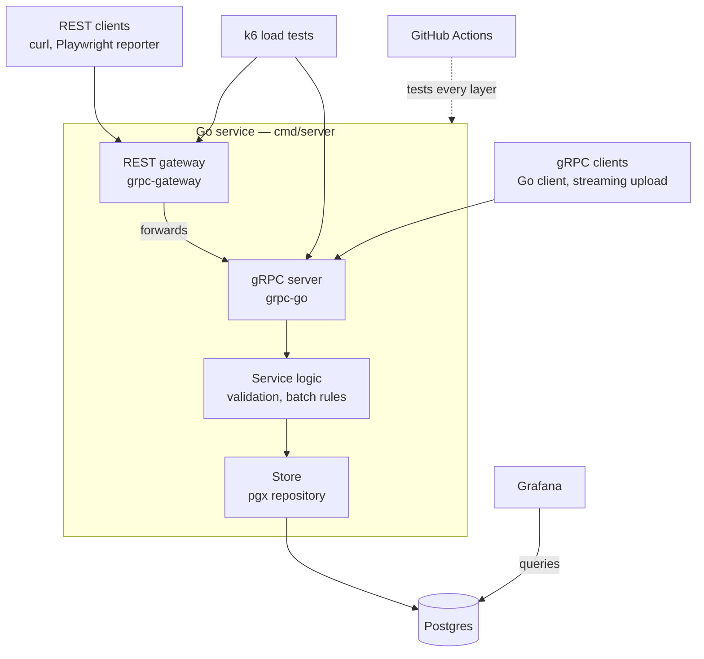

# results-service

[](https://github.com/adamsjoe/results-service/actions/workflows/ci.yml)

A Go backend that ingests automated test results over **gRPC** and **REST**, stores them in **Postgres** and feeds **Grafana** dashboards — built and tested to production standard.

The service is the vehicle; the testing is the point. Every layer is covered: unit tests written test-first, integration tests against real Postgres, API tests over both protocols, k6 load tests and deliberate reliability tests, all running in CI.

> **Status:** Milestone 1 of 10 complete — skeleton service running in Docker with CI. See [Roadmap](#roadmap).

---

## Quick start

**Prerequisites:** Docker Engine with Compose v2, and `make`. No local Go toolchain is needed to run the stack.

```bash
git clone https://github.com/adamsjoe/results-service.git
cd results-service
make up
curl localhost:8080/healthz   # → ok
```

| Endpoint | Address | Status |
| --- | --- | --- |
| REST | `localhost:8080` | `/healthz` only so far |
| gRPC | `localhost:9090` | Planned (milestone 5) |
| Grafana | `localhost:3000` | Running, dashboards planned (milestone 9) |
| Postgres | `localhost:5432` | Running |

### Make targets

| Target | Does |
| --- | --- |
| `make up` | Build and start the stack |
| `make down` | Stop the stack, keep data |
| `make reset` | Stop the stack and wipe the database |
| `make logs` | Follow server logs |
| `make psql` | SQL shell on the app database |
| `make test` | Run all Go test layers in a container *(from milestone 3)* |
| `make load` | Run the k6 baseline against the stack *(from milestone 8)* |

---

## Architecture



REST calls pass through the gateway into the same gRPC handlers, so both protocols share one code path down to Postgres. Grafana reads the tables directly.

The server binary has three subcommands so one image does every job:

| Subcommand | Does |
| --- | --- |
| `serve` | Runs the server (default) |
| `migrate` | Applies database migrations (stub until milestone 4) |
| `healthcheck` | Calls `/healthz`, exits non-zero on failure — used by Docker, as the distroless image has no shell or curl |

---

## Planned API

One protobuf file (`proto/results/v1/results.proto`) defines the API; the REST layer is generated from it.

| RPC | REST | Notes |
| --- | --- | --- |
| `CreateRun` | `POST /v1/runs` | Start a test run (suite, branch, commit) |
| `RecordResults` | `POST /v1/runs/{run_id}/results` | Batch of up to 1,000 results |
| `StreamResults` | — | gRPC only: client-streaming upload |
| `GetRun` | `GET /v1/runs/{run_id}` | Run with pass/fail/skip counts |
| `ListRuns` | `GET /v1/runs` | Paginated, filterable by suite |

---

## Test strategy

| Layer | Runs against | Covers |
| --- | --- | --- |
| Unit (TDD) | In-memory fake store | Validation, partial-batch acceptance, pagination rules |
| Integration | Real Postgres (testcontainers-go / test container) | Queries, constraints, migrations |
| gRPC API | Running service | Every RPC, status codes, streaming, deadlines |
| REST API | Running service over HTTP | Same behaviours via the gateway, HTTP status mapping |
| Contract | Proto file | `buf lint` and `buf breaking` against main |
| Load | Docker Compose stack | k6 throughput and latency, both protocols |
| Reliability | Running service | Timeouts, cancellation, database loss, graceful shutdown |

---

## Tech stack

Go · grpc-go · grpc-gateway v2 · buf · pgx v5 · goose · testcontainers-go · k6 · golangci-lint · Docker Compose · Grafana · GitHub Actions

---

## Roadmap

| # | Milestone | Status |
| --- | --- | --- |
| 1 | Skeleton — stub server, Docker stack, CI | ✅ Done |
| 2 | Proto and codegen with buf | ⬜ Next |
| 3 | Service logic, test-first | ⬜ |
| 4 | Postgres store and migrations | ⬜ |
| 5 | gRPC server | ⬜ |
| 6 | REST gateway | ⬜ |
| 7 | Reliability tests | ⬜ |
| 8 | Load tests (k6) | ⬜ |
| 9 | Grafana dashboard | ⬜ |
| 10 | README: results and write-up | ⬜ |

---

## Issues and fixes log

Problems hit during the build and how they were resolved. Newest first.

| Milestone | Issue | Cause | Fix |
| --- | --- | --- | --- |
| 2 | Original API design would not pass buf `STANDARD` lint | `CreateRun`/`GetRun` shared a `Run` response, `StreamResults` streamed bare `TestResult`s, and enum values lacked the `STATUS_` prefix | Every RPC has its own `<Rpc>Request`/`<Rpc>Response`; enum values renamed `STATUS_PASSED` etc. |
| 1 | golangci-lint found two `errcheck` issues in the first stub (caught before the first push) | golangci-lint v2 flags unchecked errors from `fmt.Fprintln` and `resp.Body.Close` | Errors explicitly discarded (`_, _ =` and a deferred closure) |
| 1 | `make up` failed: `"/go.sum": not found` | `go.sum` only exists once a module has external dependencies; the stub is standard library only | Dockerfile copies `go.sum*`, making it optional |
